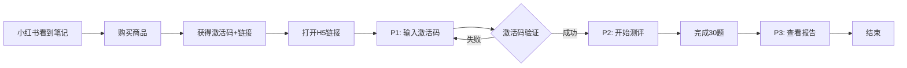

# 社恐程度测试 - 极简MVP原型设计文档

## 📋 文档信息

| 项目 | 信息 |
|------|------|
| **产品名称** | 社恐程度专业测评 |
| **产品类型** | 激活码制心理测评H5 |
| **文档版本** | V1.0 MVP极简版 |
| **创建日期** | 2025年11月3日 |
| **设计风格** | 高级国风 · 简约专业 |

---

## 一、产品流程（极简版）

### 1.1 完整用户旅程



### 1.2 产品架构

```
社恐测试MVP（3个页面）
│
├─ P1. 激活页
│   └─ 用户输入激活码进入测评
│
├─ P2. 测评页
│   └─ 完成30道测试题
│
└─ P3. 报告页
    └─ 展示完整测评结果
```

---

## 二、配色系统

### 2.1 配色方案概览

基于国风美学，提供4套配色方案（2浅+2深）：

```
配色方案1：雪尽霜余（浅色）  |  配色方案2：雪尽霜余（深色）
配色方案3：芩江初雪（浅色）  |  配色方案4：芩江初雪（深色）
```

---

### 2.2 配色方案1：雪尽霜余（浅色）

**设计理念**：高级灰调，温润雅致

```
【主色调】
主色：     #BA9B92  灰茶红（按钮、强调）
辅助色：   #987F74  栂枯褐（次要元素）
中性色：   #C4C0C1  辣茶灰（边框、图标）

【背景色】
主背景：   #F0ECEB  雪白（页面底色）
卡片背景： #FFFFFF  纯白
分区背景： #F8F6F5  浅米

【文字色】
标题：     #2C2422  深褐黑
正文：     #5C5452  灰褐
次要：     #8C8482  浅灰褐
禁用：     #C4C0C1  辣茶灰

【功能色】
成功：     #91A88E  雅绿
警告：     #D4A574  浅褐
错误：     #C8837B  淡赤
信息：     #8C9CAA  青灰
```

**视觉示例**：
```
┌────────────────────────────────┐
│  背景: #F0ECEB                  │
│  ┌──────────────────────────┐  │
│  │ 卡片: #FFFFFF             │  │
│  │ 标题: #2C2422             │  │
│  │ 正文: #5C5452             │  │
│  │ [按钮: #BA9B92]           │  │
│  └──────────────────────────┘  │
└────────────────────────────────┘
```

---

### 2.3 配色方案2：雪尽霜余（深色）

**设计理念**：暗夜雅韵，沉稳内敛

```
【主色调】
主色：     #D4B5AC  浅茶粉（按钮、强调）
辅助色：   #B09286  浅栂褐（次要元素）
中性色：   #A8A4A2  灰石（边框、图标）

【背景色】
主背景：   #1C1816  深黑褐（页面底色）
卡片背景： #2A2624  炭褐
分区背景： #35322F  暗褐

【文字色】
标题：     #EAE6E3  米白
正文：     #C4BFB9  灰米
次要：     #8C8784  浅灰
禁用：     #5C5854  暗灰

【功能色】
成功：     #A8BFA5  浅雅绿
警告：     #D9B98C  浅金褐
错误：     #D49B93  粉赤
信息：     #9DAAB7  青蓝灰
```

**视觉示例**：
```
┌────────────────────────────────┐
│  背景: #1C1816                  │
│  ┌──────────────────────────┐  │
│  │ 卡片: #2A2624             │  │
│  │ 标题: #EAE6E3             │  │
│  │ 正文: #C4BFB9             │  │
│  │ [按钮: #D4B5AC]           │  │
│  └──────────────────────────┘  │
└────────────────────────────────┘
```

---

### 2.4 配色方案3：芩江初雪（浅色）

**设计理念**：清新淡雅，自然舒缓

```
【主色调】
主色：     #8BA995  淄翡绿（按钮、强调）
辅助色：   #A1C1A1  水泽绿（次要元素）
中性色：   #D2C4B2  膏松棕（边框、图标）

【背景色】
主背景：   #DFDAD3  雪芽白（页面底色）
卡片背景： #FFFFFF  纯白
分区背景： #EBE7E0  浅米白

【文字色】
标题：     #2C3428  深墨绿
正文：     #4A5446  灰绿
次要：     #7A826E  浅绿灰
禁用：     #B8B5A8  灰米

【功能色】
成功：     #8BA995  淄翡绿
警告：     #C8B699  浅褐米
错误：     #B8857A  淡褐红
信息：     #84A3AA  青灰蓝
```

**视觉示例**：
```
┌────────────────────────────────┐
│  背景: #DFDAD3                  │
│  ┌──────────────────────────┐  │
│  │ 卡片: #FFFFFF             │  │
│  │ 标题: #2C3428             │  │
│  │ 正文: #4A5446             │  │
│  │ [按钮: #8BA995]           │  │
│  └──────────────────────────┘  │
└────────────────────────────────┘
```

---

### 2.5 配色方案4：芩江初雪（深色）

**设计理念**：幽林夜色，静谧深邃

```
【主色调】
主色：     #A8C9A8  浅水绿（按钮、强调）
辅助色：   #B8D4B8  淡翠绿（次要元素）
中性色：   #C8BCA8  浅松褐（边框、图标）

【背景色】
主背景：   #1A1E1A  深墨绿（页面底色）
卡片背景： #252A25  暗绿褐
分区背景： #30352E  深灰绿

【文字色】
标题：     #E5E8E3  淡绿白
正文：     #BFC5BA  灰绿白
次要：     #8C9488  浅灰绿
禁用：     #5A5E58  暗灰绿

【功能色】
成功：     #A8C9A8  浅水绿
警告：     #D4C4A8  浅米褐
错误：     #C89F95  粉褐
信息：     #94AEB8  浅青蓝
```

**视觉示例**：
```
┌────────────────────────────────┐
│  背景: #1A1E1A                  │
│  ┌──────────────────────────┐  │
│  │ 卡片: #252A25             │  │
│  │ 标题: #E5E8E3             │  │
│  │ 正文: #BFC5BA             │  │
│  │ [按钮: #A8C9A8]           │  │
│  └──────────────────────────┘  │
└────────────────────────────────┘
```

---

### 2.6 配色使用建议

```
【默认推荐】
- 浅色模式首选：配色方案1（雪尽霜余浅色）- 温润雅致
- 深色模式首选：配色方案2（雪尽霜余深色）- 沉稳内敛

【场景推荐】
- 白天/办公场景：方案1或方案3（浅色）
- 夜晚/休闲场景：方案2或方案4（深色）
- 追求温暖感：方案1+2（灰茶红系）
- 追求清新感：方案3+4（翡翠绿系）

【切换逻辑】
- 自动跟随系统：根据设备深色模式自动切换
- 手动切换：在报告页提供配色切换功能（可选）
```

---

## 三、页面原型设计

### P1. 激活页（Activation Page）

#### 3.1.1 页面目标
- 验证用户购买凭证
- 提供简洁专业的第一印象
- 引导用户开始测评

#### 3.1.2 页面布局（以配色方案1为例）

```
┌─────────────────────────────────────┐
│                                     │ 
│                                     │ 顶部留白60px
│                                     │
│         社恐程度专业测评             │ 标题36px Bold #2C2422
│         Social Anxiety Assessment   │ 英文副标题14px #8C8482
│                                     │
│         ━━━━━━━━━━━━━━━━━━━━━      │ 装饰线1px #C4C0C1
│                                     │
│                                     │
│   基于SAS社交焦虑量表改良            │ 说明文字16px #5C5452
│   30题 · 5-8分钟 · 专业分析          │
│                                     │
│                                     │
│   ┌─────────────────────────────┐  │
│   │                             │  │ 输入框卡片
│   │  请输入您的激活码            │  │ 16px #8C8482
│   │  ┌───────────────────────┐  │  │
│   │  │                       │  │  │ 输入框48px高
│   │  │  输入激活码...         │  │  │ placeholder #C4C0C1
│   │  └───────────────────────┘  │  │ 边框1px #C4C0C1
│   │                             │  │ 聚焦时边框2px #BA9B92
│   │  激活码格式：XXXX-XXXX-XXXX  │  │ 提示12px #8C8482
│   │                             │  │
│   └─────────────────────────────┘  │
│                                     │
│                                     │
│   ┌─────────────────────────────┐  │
│   │      开始测评               │  │ 主按钮56px高
│   └─────────────────────────────┘  │ 背景#BA9B92 文字#FFFFFF
│                                     │ 圆角8px 18px Bold
│                                     │ hover时#A88B82
│                                     │
│                                     │
│   激活码无效？请检查格式或联系客服    │ 帮助文字12px #8C8482
│                                     │
│                                     │
│                                     │
│   ━━━━━━━━━━━━━━━━━━━━━━━━━━━━━   │
│   数据安全 · 隐私保护 · 仅供自我探索  │ 底部说明12px #C4C0C1
│                                     │
└─────────────────────────────────────┘
```

#### 3.1.3 交互逻辑

| 元素 | 交互行为 | 反馈 |
|------|---------|-----|
| **激活码输入框** | 聚焦 | 边框变为主色，2px粗细 |
| **激活码输入框** | 输入 | 自动转大写，格式化为XXXX-XXXX-XXXX |
| **[开始测评]按钮** | 未输入激活码 | 禁用状态，灰色背景 |
| **[开始测评]按钮** | 已输入激活码 | 可点击，hover时颜色加深 |
| **验证失败** | Toast提示 | "激活码无效，请检查后重试" 2秒消失 |
| **验证成功** | 页面跳转 | 淡出动画0.3s → 跳转测评页 |

#### 3.1.4 激活码验证规则

```javascript
// 激活码格式验证
function validateActivationCode(code) {
  // 格式：4位-4位-4位（数字+大写字母）
  const pattern = /^[A-Z0-9]{4}-[A-Z0-9]{4}-[A-Z0-9]{4}$/;
  return pattern.test(code);
}

// 自动格式化
function formatActivationCode(input) {
  // 移除非字母数字字符
  let cleaned = input.replace(/[^A-Z0-9]/gi, '').toUpperCase();
  
  // 限制12个字符
  cleaned = cleaned.slice(0, 12);
  
  // 添加连字符
  let formatted = '';
  for (let i = 0; i < cleaned.length; i++) {
    if (i > 0 && i % 4 === 0) formatted += '-';
    formatted += cleaned[i];
  }
  
  return formatted;
}
```

---

### P2. 测评页（Assessment Page）

#### 3.2.1 页面目标
- 提供流畅的答题体验
- 实时展示进度，减少焦虑
- 确保答题数据准确保存

#### 3.2.2 页面布局（单题版）

```
┌─────────────────────────────────────┐
│                                     │ 顶部栏固定
│  社恐程度测评    第3题/共30题  10%   │ 16px #5C5452
│  ▓▓▓░░░░░░░░░░░░░░░░░░░░░░░░░░░░   │ 进度条4px高 #BA9B92
├─────────────────────────────────────┤
│                                     │
│                                     │
│                                     │
│                                     │ 主内容区域
│                                     │ 垂直居中显示
│  在电梯或狭小空间里遇到              │
│  陌生人时，你的感受是？              │ 题目24px Semibold #2C2422
│                                     │ 行高1.6
│                                     │
│                                     │
│  ┌─────────────────────────────┐  │
│  │ ○  完全自然，不会紧张        │  │ 选项1
│  └─────────────────────────────┘  │ 卡片样式
│                                     │ 18px Regular #5C5452
│  ┌─────────────────────────────┐  │ 背景#FFFFFF
│  │ ○  略有不适，但可以应对      │  │ 边框1px #C4C0C1
│  └─────────────────────────────┘  │ 圆角12px
│                                     │ 内边距20px
│  ┌─────────────────────────────┐  │ 间距12px
│  │ ○  明显紧张，避免眼神接触    │  │
│  └─────────────────────────────┘  │
│                                     │
│  ┌─────────────────────────────┐  │
│  │ ○  非常紧张，心跳加速        │  │
│  └─────────────────────────────┘  │
│                                     │
│  ┌─────────────────────────────┐  │
│  │ ○  极度焦虑，想立刻离开      │  │
│  └─────────────────────────────┘  │
│                                     │
│                                     │
│                                     │
├─────────────────────────────────────┤
│   [  上一题  ]       [  下一题  ]   │ 底部操作栏
│                                     │ 按钮40px高
│                                     │ 背景#F8F6F5
└─────────────────────────────────────┘
```

#### 3.2.3 选中状态设计（配色方案1）

```
【未选中】
┌─────────────────────────────┐
│ ○  完全自然，不会紧张        │  背景: #FFFFFF
└─────────────────────────────┘  边框: 1px #C4C0C1
                                 文字: #5C5452

【Hover】
┌─────────────────────────────┐
│ ○  完全自然，不会紧张        │  背景: #F8F6F5
└─────────────────────────────┘  边框: 1px #BA9B92
                                 轻微上移2px

【选中】
┌─────────────────────────────┐
│ ◉  完全自然，不会紧张 ✓      │  背景: #F8F6F5
└─────────────────────────────┘  边框: 2px #BA9B92
                                 文字: #2C2422 Bold
                                 右侧✓: 16px #BA9B92
```

#### 3.2.4 题目设计（30题）

**维度分布**：
- 社交场景恐惧（5题）：Q1-Q5
- 回避行为程度（5题）：Q6-Q10
- 预期焦虑强度（5题）：Q11-Q15
- 社交后反刍（5题）：Q16-Q20
- 生理反应强度（5题）：Q21-Q25
- 社交自我效能（5题）：Q26-Q30

**题目示例**：

```
Q1. 需要参加多人聚会时，你的第一反应是？
- 期待见到朋友，感到开心
- 有些紧张但愿意参加
- 明显焦虑，需要心理准备
- 非常抗拒，想找理由推脱
- 绝对不会参加

Q2. 需要给陌生人打电话时，你会？
- 直接拨打，没有压力
- 简单准备后拨打
- 反复演练措辞，需要心理建设
- 能用文字绝不打电话
- 宁愿放弃也不愿打电话

Q3. 在电梯或狭小空间里遇到陌生人时，你的感受是？
- 完全自然，不会紧张
- 略有不适，但可以应对
- 明显紧张，避免眼神接触
- 非常紧张，心跳加速
- 极度焦虑，想立刻离开

...（省略Q4-Q30）
```

**计分规则**：
```
第1个选项：1分
第2个选项：2分
第3个选项：3分
第4个选项：4分
第5个选项：5分

总分范围：30-150分
```

#### 3.2.5 答题页交互逻辑

| 用户行为 | 系统响应 | 备注 |
|---------|---------|-----|
| **选择选项** | 1. 选项高亮<br>2. 等待0.5s<br>3. 自动跳转下一题 | 流畅体验 |
| **点击[下一题]** | 未作答→提示"请选择答案"<br>已作答→跳转下一题 | Toast提示 |
| **点击[上一题]** | 返回上一题，保留原答案 | 允许修改 |
| **第30题完成** | 显示[提交测评]按钮 | 主按钮样式 |
| **点击[提交]** | 显示Loading → 生成报告 → 跳转报告页 | 3秒Loading |

#### 3.2.6 进度提示

```
每完成10题显示进度提示（Toast, 1.5s自动消失）：

┌─────────────────────────────┐
│   已完成33%，继续加油！      │ 背景: #F8F6F5
└─────────────────────────────┘ 文字: #5C5452
                                边框: 1px #BA9B92

10题(33%) → "已完成33%，继续加油！"
20题(67%) → "已完成67%，马上完成！"
30题(100%)→ "测评完成，正在生成报告..."
```

#### 3.2.7 答案自动保存

```javascript
// 实时保存到LocalStorage
function saveAnswer(questionId, answerId) {
  const answers = JSON.parse(localStorage.getItem('test_answers') || '{}');
  answers[questionId] = answerId;
  answers.lastUpdate = Date.now();
  localStorage.setItem('test_answers', JSON.stringify(answers));
}

// 页面加载时恢复进度
function loadProgress() {
  const answers = JSON.parse(localStorage.getItem('test_answers') || '{}');
  if (Object.keys(answers).length > 0) {
    // 提示用户是否继续之前的测评
    showResumeDialog();
  }
}
```

---

### P3. 报告页（Report Page）

#### 3.3.1 页面目标
- 清晰展示测评结果
- 提供专业深度的分析
- 给予用户改善建议和希望感

#### 3.3.2 页面布局（长页面滚动）

```
┌─────────────────────────────────────┐
│  [< 返回]     测评报告    [切换配色]  │ 顶部导航固定
├─────────────────────────────────────┤
│                                     │
│   ┌─────────────────────────────┐  │ § 1. 总分卡片
│   │                             │  │ 背景渐变
│   │     社恐程度评估结果         │  │ #BA9B92→#C4B0A8
│   │                             │  │ 文字白色
│   │        中度偏轻              │  │ 32px Bold
│   │                             │  │
│   │     综合得分：78分           │  │ 48px Bold
│   │     击败全国 62% 的测试者    │  │ 16px Regular
│   │                             │  │
│   └─────────────────────────────┘  │
│                                     │
│   ┌─────────────────────────────┐  │ § 2. 等级图示
│   │  社恐等级分布                │  │ 卡片标题
│   │  ━━━━━━━━━━━━━━━━━━━━━━   │  │ 16px Semibold
│   │                             │  │
│   │  30 ─────── 78 ────── 150  │  │ 刻度线
│   │  ▓▓▓▓▓▓▓▓██░░░░░░░░░       │  │ 渐变进度条
│   │  轻度  中度  重度  极重度     │  │ 12px
│   │        ↑                    │  │
│   │     你在这里                 │  │ 14px #BA9B92
│   │                             │  │
│   └─────────────────────────────┘  │
│                                     │
│   ━━━━━━━━━━━━━━━━━━━━━━━━━━━━━   │ 分隔线
│                                     │
│   ┌─────────────────────────────┐  │ § 3. 六维分析
│   │  六维度深度分析              │  │ 卡片标题
│   │  ━━━━━━━━━━━━━━━━━━━━━━   │  │
│   │                             │  │
│   │     社交场景恐惧             │  │ 雷达图
│   │          ↑                  │  │ 使用ECharts
│   │          |                  │  │ 主色填充半透明
│   │          |    ●             │  │
│   │  自我────┼────预期焦虑      │  │
│   │  效能    |                  │  │
│   │       ●  |  ●               │  │
│   │          |                  │  │
│   │       ●  ●                  │  │
│   │      /    \                 │  │
│   │  回避    社交                │  │
│   │  行为    反刍                │  │
│   │                             │  │
│   │  ━━━━━━━━━━━━━━━━━━━━━━   │  │
│   │                             │  │
│   │  维度详解                    │  │ 16px Semibold
│   │                             │  │
│   │  1. 社交场景恐惧             │  │ 维度名称
│   │     ████████░░ 20/25        │  │ 进度条+分数
│   │     偏高                     │  │ 评级
│   │     → 在多人聚会、公开场合   │  │ 解读文字
│   │       容易感到紧张           │  │ 15px Regular
│   │                             │  │ #5C5452
│   │  2. 回避行为程度             │  │
│   │     ██████░░░░ 15/25        │  │
│   │     中等                     │  │
│   │     → 会选择性参加社交活动   │  │
│   │                             │  │
│   │  3. 预期焦虑强度             │  │
│   │     █████████░ 22/25        │  │
│   │     高 ⚠                     │  │ 警告标识
│   │     → 事前过度担心是你的痛点 │  │
│   │                             │  │
│   │  4. 社交后反刍               │  │
│   │     ███████░░░ 18/25        │  │
│   │     中高                     │  │
│   │     → 事后经常后悔说错话     │  │
│   │                             │  │
│   │  5. 生理反应强度             │  │
│   │     ████░░░░░░ 10/25        │  │
│   │     较低 ✓                   │  │ 好消息标识
│   │     → 身体反应不算严重       │  │
│   │                             │  │
│   │  6. 社交自我效能             │  │
│   │     ███░░░░░░░ 8/25         │  │
│   │     低                       │  │
│   │     → 不太相信自己能处理好   │  │
│   │       社交情境               │  │
│   │                             │  │
│   └─────────────────────────────┘  │
│                                     │
│   ━━━━━━━━━━━━━━━━━━━━━━━━━━━━━   │
│                                     │
│   ┌─────────────────────────────┐  │ § 4. 类型诊断
│   │  你的社恐类型                │  │
│   │  ━━━━━━━━━━━━━━━━━━━━━━   │  │
│   │                             │  │
│   │      「预演型社恐」           │  │ 类型标签
│   │                             │  │ 28px Bold
│   │   Rehearsal-Type Social     │  │ 英文副标题
│   │   Anxiety                   │  │ 14px Regular
│   │                             │  │
│   │  ━━━━━━━━━━━━━━━━━━━━━━   │  │
│   │                             │  │
│   │  核心特征                    │  │ 小标题
│   │                             │  │
│   │  · 事前过度担心              │  │ 特征列表
│   │    脑补各种糟糕场景          │  │ 16px Regular
│   │                             │  │ 行高1.8
│   │  · 反复预演对话              │  │
│   │    准备"完美"表现            │  │
│   │                             │  │
│   │  · 实际社交时反而还好        │  │
│   │                             │  │
│   │  · 事后又开始反刍和懊悔      │  │
│   │                             │  │
│   │  ━━━━━━━━━━━━━━━━━━━━━━   │  │
│   │                             │  │
│   │  心理根源分析                │  │
│   │                             │  │
│   │  你的社恐本质上源于：         │  │
│   │                             │  │
│   │  1. 完美主义倾向             │  │ 根源分析
│   │     害怕在他人面前展现       │  │ 16px Regular
│   │     "不完美"的自己           │  │
│   │                             │  │
│   │  2. 低自我接纳               │  │
│   │     对自己要求过高           │  │
│   │     容错率太低               │  │
│   │                             │  │
│   │  3. 过度关注他人评价         │  │
│   │     "他们会怎么看我"         │  │
│   │     成为最大压力源           │  │
│   │                             │  │
│   │  ━━━━━━━━━━━━━━━━━━━━━━   │  │
│   │                             │  │
│   │  重新认识你的社恐            │  │
│   │                             │  │
│   │  预演型社恐者往往：          │  │ 正向重构
│   │  · 共情能力强                │  │ 15px Regular
│   │  · 善于观察细节              │  │
│   │  · 内心细腻敏感              │  │
│   │                             │  │
│   │  这不是缺陷，而是特质。      │  │
│   │  关键是学会接纳"不完美"的    │  │
│   │  社交，而非追求"完美"表现。  │  │
│   │                             │  │
│   └─────────────────────────────┘  │
│                                     │
│   ━━━━━━━━━━━━━━━━━━━━━━━━━━━━━   │
│                                     │
│   ┌─────────────────────────────┐  │ § 5. 改善建议
│   │  专属改善建议                │  │
│   │  ━━━━━━━━━━━━━━━━━━━━━━   │  │
│   │                             │  │
│   │  立即可行动                  │  │ 分类标题
│   │                             │  │ 18px Semibold
│   │  1. 使用"5秒法则"打断焦虑    │  │
│   │                             │  │ 建议标题
│   │  具体方法：                  │  │ 16px Regular
│   │  当你开始脑补糟糕场景时——    │  │
│   │  ① 数5个数(5-4-3-2-1)       │  │ 步骤列表
│   │  ② 立即转移注意力           │  │ 15px Regular
│   │  ③ 不给大脑"预演"的机会      │  │ 行高1.6
│   │                             │  │
│   │  原理：大脑的预期焦虑需要    │  │ 原理说明
│   │  时间累积，快速打断可以防止  │  │ 14px Regular
│   │  陷入恶性循环。              │  │ 灰色文字
│   │                             │  │
│   │  ━━━━━━━━━━━━━━━━━━━━━━   │  │
│   │                             │  │
│   │  2. 准备3个"万能话题"        │  │
│   │                             │  │
│   │  话题清单：                  │  │
│   │  · 最近看的剧/书/综艺        │  │
│   │    "你最近在追什么剧?"       │  │
│   │  · 询问对方近况              │  │
│   │    "你最近忙什么呢?"         │  │
│   │  · 分享轻松小事              │  │
│   │    "今天遇到个好玩的事..."   │  │
│   │                             │  │
│   │  技巧：使用开放式问题        │  │
│   │  （不能yes/no回答），让对方   │  │
│   │  多说，你就轻松了。          │  │
│   │                             │  │
│   │  ━━━━━━━━━━━━━━━━━━━━━━   │  │
│   │                             │  │
│   │  3. 从"低风险社交"开始       │  │
│   │                             │  │
│   │  4周渐进计划：               │  │
│   │                             │  │
│   │  Week 1：线上语音练习        │  │ 周计划
│   │  · 微信语音聊天(vs文字)      │  │ 15px Regular
│   │  · 每天至少1次，3分钟以上    │  │
│   │                             │  │
│   │  Week 2：陌生人电话          │  │
│   │  · 给不熟的人打电话          │  │
│   │    (快递、外卖、客服)        │  │
│   │  · 提前准备要说的话          │  │
│   │                             │  │
│   │  Week 3：熟人单独见面        │  │
│   │  · 主动约1个熟人             │  │
│   │  · 选轻松场所(咖啡厅)        │  │
│   │  · 控制在1-2小时             │  │
│   │                             │  │
│   │  Week 4：小规模聚会          │  │
│   │  · 参加3-5人小聚             │  │
│   │  · 可带熟人同去              │  │
│   │  · 允许自己提前离开          │  │
│   │                             │  │
│   │  关键原则：从舒适区边缘开始， │  │
│   │  逐步扩展，不要一下子跳到    │  │
│   │  最难的。                    │  │
│   │                             │  │
│   │  ━━━━━━━━━━━━━━━━━━━━━━   │  │
│   │                             │  │
│   │  长期改善路径                │  │
│   │                             │  │
│   │  推荐阅读：                  │  │ 资源推荐
│   │  · 《社交焦虑自助手册》       │  │ 15px Regular
│   │    吉莉恩·巴特勒             │  │
│   │  · 《被讨厌的勇气》           │  │
│   │    岸见一郎                  │  │
│   │                             │  │
│   │  推荐练习：                  │  │
│   │  · 正念冥想(降低预期焦虑)     │  │
│   │  · 认知行为疗法CBT           │  │
│   │    (改变思维模式)            │  │
│   │                             │  │
│   │  改善需要时间，一般需要      │  │
│   │  3-6个月持续练习。           │  │
│   │  每一小步都是进步。          │  │
│   │                             │  │
│   │  ━━━━━━━━━━━━━━━━━━━━━━   │  │
│   │                             │  │
│   │  何时需要专业帮助？          │  │ 预警区域
│   │                             │  │ 浅色背景
│   │  如果你的社恐已经：          │  │ 警告色边框
│   │  · 严重影响工作/学习         │  │
│   │  · 导致完全的社交隔离        │  │
│   │  · 伴随抑郁、惊恐发作        │  │
│   │                             │  │
│   │  建议咨询：                  │  │
│   │  心理咨询师或精神科医生      │  │
│   │                             │  │
│   └─────────────────────────────┘  │
│                                     │
│   ━━━━━━━━━━━━━━━━━━━━━━━━━━━━━   │
│                                     │
│                                     │ § 6. 报告说明
│   测评说明                          │ 14px Regular
│   · 本测评基于SAS社交焦虑量表改良   │ #8C8482
│   · 测评结果仅供自我探索参考        │
│   · 不构成医疗诊断，如有严重心理    │
│     问题请寻求专业帮助              │
│   · 测评时间：2025年11月3日         │
│                                     │
│   ━━━━━━━━━━━━━━━━━━━━━━━━━━━━━   │
│                                     │
│   数据安全 · 隐私保护 · 专业可信     │ 12px #C4C0C1
│                                     │
└─────────────────────────────────────┘
```

#### 3.3.3 雷达图技术实现

```javascript
// 使用ECharts生成雷达图（配色方案1）
const radarOption = {
  backgroundColor: 'transparent',
  radar: {
    indicator: [
      { name: '社交场景恐惧', max: 100 },
      { name: '回避行为', max: 100 },
      { name: '预期焦虑', max: 100 },
      { name: '社交反刍', max: 100 },
      { name: '生理反应', max: 100 },
      { name: '自我效能', max: 100 }
    ],
    radius: 100,
    splitNumber: 4,
    name: {
      textStyle: {
        color: '#5C5452',
        fontSize: 14,
        fontWeight: 400
      }
    },
    splitLine: {
      lineStyle: {
        color: '#C4C0C1',
        type: 'dashed',
        width: 1
      }
    },
    splitArea: {
      areaStyle: {
        color: 'transparent'
      }
    },
    axisLine: {
      lineStyle: {
        color: '#C4C0C1',
        width: 1
      }
    }
  },
  series: [{
    type: 'radar',
    data: [{
      value: [80, 60, 88, 72, 40, 32],
      name: '你的数据',
      areaStyle: {
        color: 'rgba(186, 155, 146, 0.2)'  // #BA9B92 20%透明度
      },
      lineStyle: {
        color: '#BA9B92',
        width: 2
      },
      itemStyle: {
        color: '#BA9B92',
        borderColor: '#FFFFFF',
        borderWidth: 2
      }
    }]
  }]
};

// 深色模式（配色方案2）
const radarOptionDark = {
  // ... 相同结构，替换颜色
  radar: {
    name: {
      textStyle: {
        color: '#C4BFB9'  // 深色模式文字色
      }
    },
    splitLine: {
      lineStyle: {
        color: '#5C5854'  // 深色模式边框
      }
    }
  },
  series: [{
    data: [{
      areaStyle: {
        color: 'rgba(212, 181, 172, 0.2)'  // #D4B5AC 20%透明度
      },
      lineStyle: {
        color: '#D4B5AC'
      },
      itemStyle: {
        color: '#D4B5AC',
        borderColor: '#2A2624'
      }
    }]
  }]
};
```

#### 3.3.4 报告生成逻辑

```javascript
// 计算分数和生成报告
function generateReport(answers) {
  // 1. 计算总分和维度分
  const scores = calculateScores(answers);
  
  // 2. 判断等级
  const level = getLevel(scores.total);
  
  // 3. 判断类型
  const type = getType(scores.dimensions);
  
  // 4. 生成报告内容
  const report = {
    // 基础信息
    testDate: new Date().toISOString(),
    totalScore: scores.total,
    level: level,
    percentile: calculatePercentile(scores.total),
    
    // 维度数据
    dimensions: [
      {
        name: '社交场景恐惧',
        score: scores.dimensions.scene_fear,
        maxScore: 25,
        percentage: (scores.dimensions.scene_fear / 25 * 100).toFixed(0),
        level: getDimensionLevel(scores.dimensions.scene_fear),
        interpretation: getDimensionInterpretation('scene_fear', scores.dimensions.scene_fear)
      },
      // ... 其他维度
    ],
    
    // 类型诊断
    type: {
      name: type.name,
      englishName: type.englishName,
      features: type.features,
      rootCauses: type.rootCauses,
      positiveReframe: type.positiveReframe
    },
    
    // 改善建议
    suggestions: getSuggestions(type, scores)
  };
  
  return report;
}

// 计算各维度得分
function calculateScores(answers) {
  const dimensions = {
    scene_fear: [1, 2, 3, 4, 5],
    avoidance: [6, 7, 8, 9, 10],
    anticipation: [11, 12, 13, 14, 15],
    rumination: [16, 17, 18, 19, 20],
    physical: [21, 22, 23, 24, 25],
    self_efficacy: [26, 27, 28, 29, 30]
  };
  
  let totalScore = 0;
  let dimensionScores = {};
  
  Object.entries(dimensions).forEach(([key, questionIds]) => {
    let sum = 0;
    questionIds.forEach(id => {
      sum += parseInt(answers[id] || 0);
    });
    dimensionScores[key] = sum;
    totalScore += sum;
  });
  
  return {
    total: totalScore,
    dimensions: dimensionScores
  };
}

// 判断等级
function getLevel(score) {
  if (score <= 60) return { name: '轻度', color: '#91A88E' };
  if (score <= 90) return { name: '中度', color: '#D4A574' };
  if (score <= 120) return { name: '重度', color: '#C8837B' };
  return { name: '极重度', color: '#C8837B' };
}

// 判断类型
function getType(dimensions) {
  // 预演型：预期焦虑高 + 社交反刍高
  if (dimensions.anticipation >= 18 && dimensions.rumination >= 15) {
    return {
      name: '预演型社恐',
      englishName: 'Rehearsal-Type Social Anxiety',
      features: [
        '事前过度担心，脑补各种糟糕场景',
        '反复预演对话，准备"完美"表现',
        '实际社交时反而还好',
        '事后又开始反刍和懊悔'
      ],
      rootCauses: [
        { title: '完美主义倾向', desc: '害怕在他人面前展现"不完美"的自己' },
        { title: '低自我接纳', desc: '对自己要求过高，容错率太低' },
        { title: '过度关注他人评价', desc: '"他们会怎么看我"成为最大压力源' }
      ],
      positiveReframe: '预演型社恐者往往共情能力强、善于观察细节、内心细腻敏感。这不是缺陷，而是特质。关键是学会接纳"不完美"的社交，而非追求"完美"表现。'
    };
  }
  
  // 回避型：回避行为高 + 社交场景恐惧高
  if (dimensions.avoidance >= 18 && dimensions.scene_fear >= 18) {
    return {
      name: '回避型社恐',
      englishName: 'Avoidant-Type Social Anxiety',
      // ...
    };
  }
  
  // 表演型：生理反应高 + 自我效能低
  if (dimensions.physical >= 18 && dimensions.self_efficacy <= 10) {
    return {
      name: '表演型社恐',
      englishName: 'Performance-Type Social Anxiety',
      // ...
    };
  }
  
  // 默认：轻度社恐
  return {
    name: '轻度社恐',
    englishName: 'Mild Social Anxiety',
    // ...
  };
}

// 获取个性化建议
function getSuggestions(type, scores) {
  // 根据类型和分数提供个性化建议
  const suggestions = {
    immediate: [],  // 立即可行动
    weekly: {},     // 4周计划
    longTerm: []    // 长期资源
  };
  
  // 根据类型定制建议
  if (type.name === '预演型社恐') {
    suggestions.immediate = [
      {
        title: '使用"5秒法则"打断焦虑',
        steps: [
          '当你开始脑补糟糕场景时',
          '数5个数(5-4-3-2-1)',
          '立即转移注意力(做别的事)',
          '不给大脑"预演"的机会'
        ],
        reason: '大脑的预期焦虑需要时间累积，快速打断可以防止陷入恶性循环。'
      },
      // ... 更多建议
    ];
  }
  
  return suggestions;
}
```

#### 3.3.5 配色切换功能

```
┌─────────────────────────────────────┐
│  [< 返回]     测评报告    [切换配色]  │ 点击[切换配色]弹出
└─────────────────────────────────────┘

点击后弹出配色选择面板：

┌─────────────────────────────────────┐
│                                     │
│   选择配色方案                       │ 弹窗标题
│   ━━━━━━━━━━━━━━━━━━━━━━━━━━━━━   │
│                                     │
│   ┌─────────┐  ┌─────────┐        │
│   │ 雪尽霜余 │  │ 雪尽霜余 │        │ 配色卡片
│   │  浅色   │  │  深色   │        │ 点击切换
│   │ ████   │  │ ████   │        │ 显示主色
│   └─────────┘  └─────────┘        │
│                                     │
│   ┌─────────┐  ┌─────────┐        │
│   │ 芩江初雪 │  │ 芩江初雪 │        │
│   │  浅色   │  │  深色   │        │
│   │ ████   │  │ ████   │        │
│   └─────────┘  └─────────┘        │
│                                     │
│   [取消]           [应用]           │
│                                     │
└─────────────────────────────────────┘
```

```javascript
// 配色切换逻辑
const colorSchemes = {
  scheme1Light: {
    name: '雪尽霜余（浅色）',
    primary: '#BA9B92',
    secondary: '#987F74',
    // ... 完整配色
  },
  scheme1Dark: {
    name: '雪尽霜余（深色）',
    primary: '#D4B5AC',
    // ...
  },
  scheme2Light: {
    name: '芩江初雪（浅色）',
    primary: '#8BA995',
    // ...
  },
  scheme2Dark: {
    name: '芩江初雪（深色）',
    primary: '#A8C9A8',
    // ...
  }
};

function applyColorScheme(schemeName) {
  const scheme = colorSchemes[schemeName];
  
  // 更新CSS变量
  document.documentElement.style.setProperty('--color-primary', scheme.primary);
  document.documentElement.style.setProperty('--color-secondary', scheme.secondary);
  // ... 更新所有颜色变量
  
  // 重新渲染雷达图
  updateRadarChart(schemeName);
  
  // 保存用户偏好
  localStorage.setItem('preferred_color_scheme', schemeName);
}
```

---

## 四、视觉设计规范

### 4.1 字体规范

```
【字体家族】
中文：PingFang SC (iOS), Microsoft YaHei (Windows), Noto Sans SC (Android)
英文：-apple-system, "Helvetica Neue", Arial
后备：sans-serif

【字号体系】（基于16px基准）
超大标题：48px Bold      总分展示
特大标题：36px Bold      页面主标题
大标题：  28px Bold      类型标签
中标题：  24px Semibold  题目文字
小标题：  18px Semibold  卡片标题
正文：    16px Regular   选项、描述
辅助文本：14px Regular   说明、提示
注释文本：12px Regular   版权信息

【行高】
标题：1.3
正文：1.6-1.8
密集文本：1.5

【字重】
Regular: 400 (正文)
Semibold: 600 (小标题)
Bold: 700 (大标题)
```

### 4.2 间距规范

```
【基础单位】
4px倍数系统

【间距等级】
xs:  4px    图标与文字
sm:  8px    同组元素
md:  12px   选项间距
lg:  16px   卡片内边距
xl:  24px   区块间距
xxl: 48px   页面顶部/底部

【页面布局】
页面左右边距：20px
卡片圆角：12px
卡片间距：16px
按钮圆角：8px
按钮内边距：16px(上下) 32px(左右)
```

### 4.3 阴影规范

```
【卡片阴影】（配色方案1）
浅阴影：box-shadow: 0 2px 8px rgba(44, 36, 34, 0.08);
中阴影：box-shadow: 0 4px 16px rgba(44, 36, 34, 0.12);
深阴影：box-shadow: 0 8px 24px rgba(44, 36, 34, 0.16);

【按钮阴影】
默认：box-shadow: 0 2px 4px rgba(186, 155, 146, 0.2);
hover：box-shadow: 0 4px 12px rgba(186, 155, 146, 0.3);
```

---

## 五、交互设计规范

### 5.1 动画规范

```css
/* 标准缓动函数 */
.standard-easing {
  transition: all 0.3s cubic-bezier(0.4, 0.0, 0.2, 1);
}

/* 页面转场 */
.page-transition {
  opacity: 0;
  animation: fadeIn 0.3s ease-in forwards;
}

@keyframes fadeIn {
  to { opacity: 1; }
}

/* 按钮点击 */
.button-click {
  transform: scale(0.95);
  transition: transform 0.1s ease;
}

/* 选项选中 */
.option-select {
  transform: scale(1.02);
  transition: all 0.2s ease;
}
```

### 5.2 响应式适配

```css
/* 移动端优先 */
.container {
  max-width: 100%;
  padding: 0 20px;
}

/* 大屏适配（可选） */
@media (min-width: 768px) {
  .container {
    max-width: 600px;
    margin: 0 auto;
  }
}

/* iPhone X+ 安全区域 */
.page {
  padding-top: env(safe-area-inset-top);
  padding-bottom: env(safe-area-inset-bottom);
}
```

---

## 六、技术实现

### 6.1 技术栈

```
【前端框架】
推荐：Vue 3 + Vite

【UI组件】
基础组件自定义（按设计规范）
图表：ECharts (雷达图)

【状态管理】
Pinia (Vue) / Zustand (React)

【工具库】
Day.js (日期处理)
```

### 6.2 核心功能实现

```javascript
// 激活码验证API
async function verifyActivationCode(code) {
  try {
    const response = await fetch('/api/verify-code', {
      method: 'POST',
      headers: { 'Content-Type': 'application/json' },
      body: JSON.stringify({ code })
    });
    
    const data = await response.json();
    return data.valid;
  } catch (error) {
    console.error('验证失败:', error);
    return false;
  }
}

// 提交测评结果
async function submitAssessment(answers, code) {
  const scores = calculateScores(answers);
  const report = generateReport(scores);
  
  try {
    // 保存到服务器
    await fetch('/api/save-report', {
      method: 'POST',
      headers: { 'Content-Type': 'application/json' },
      body: JSON.stringify({
        activationCode: code,
        answers,
        scores,
        report,
        timestamp: Date.now()
      })
    });
    
    return report;
  } catch (error) {
    console.error('保存失败:', error);
    // 即使保存失败，也返回报告（离线可用）
    return report;
  }
}

// 离线缓存（PWA可选）
if ('serviceWorker' in navigator) {
  navigator.serviceWorker.register('/sw.js');
}
```

### 6.3 性能优化

```
【加载优化】
- 首屏关键CSS内联
- 图片懒加载
- 代码分割（按页面）
- 雷达图按需加载

【缓存策略】
- 静态资源CDN + 强缓存
- 测评数据LocalStorage缓存
- Service Worker离线支持（可选）

【体验优化】
- 骨架屏Loading
- 乐观UI更新
- 防抖节流
```
### 6.4 说明
│   · 本测评基于SAS量表改编          │
│     仅用于评估个人社交焦虑程度     │
│   · 结果不构成诊断                │
│     如有严重问题请寻求专业帮助     │
│   · 本测评不收集个人数据          │
│     仅限本地存储和使用            │
│   · 本测评由AI设计，不保证准确性  │
│     仅供参考，不承担法律责任      │


---

## 七、交付清单

### 7.1 设计文档
- [x] 极简MVP原型设计文档（本文档）
- [x] 4套配色方案（浅色+深色）
- [x] 完整交互流程
- [x] 技术实现建议

### 7.2 开发资源（需补充）
- [ ] 30道完整题目文案
- [ ] 6种类型诊断详细文案
- [ ] 改善建议详细文案
- [ ] 配色CSS变量文件

### 7.3 后续优化方向
- [ ] 用户答题数据分析后台
- [ ] 激活码管理系统
- [ ] 测评结果分享功能（V2.0）
- [ ] 个人历史测评记录（V2.0）

---

## 八、总结

### 8.1 极简MVP核心特点

**三个页面，清晰流程**：
1. 激活页：验证购买凭证
2. 测评页：完成30题测评
3. 报告页：查看专业分析

**高级国风设计**：
- 温润雅致的灰茶红系（雪尽霜余）
- 清新舒缓的翡翠绿系（芩江初雪）
- 完整的深色模式支持
- 去除emoji，保持专业简约

**专业可信**：
- 基于SAS社交焦虑量表
- 科学的六维度分析
- 可落地的改善建议
- 隐私保护与合规

### 8.2 与复杂版本的对比

| 维度 | 复杂版 | 极简MVP |
|------|--------|---------|
| **页面数量** | 7个 | 3个 |
| **功能复杂度** | 高（付费解锁、分享、社群等） | 低（纯测评） |
| **开发周期** | 2-3周 | 3-5天 |
| **设计风格** | emoji+趣味化 | 简约专业 |
| **配色** | 单一紫色系 | 4套国风配色 |
| **适用场景** | C端大众化产品 | B端/高端定制 |

### 8.3 快速启动建议

**Day 1-2：准备内容**
- 完善30道题目
- 准备6种类型诊断文案
- 准备改善建议文案

**Day 3-4：开发基础**
- 搭建项目框架
- 实现激活码验证
- 完成页面路由

**Day 5-6：核心功能**
- 实现测评答题逻辑
- 实现计分和报告生成
- 实现配色切换

**Day 7：测试上线**
- 内部测试
- 修复问题
- 部署上线

---

**文档完成日期**：2025年11月3日  
**设计师**：AI UX设计师  
**版本**：V1.0 极简MVP版  
**下一步**：补充完整题目和文案内容

---

**配色预览**：

```
┌────────────  雪尽霜余（浅色）  ────────────┐
│  主色 #BA9B92  ████                        │
│  背景 #F0ECEB  ████                        │
│  文字 #2C2422  ████                        │
└───────────────────────────────────────────┘

┌────────────  雪尽霜余（深色）  ────────────┐
│  主色 #D4B5AC  ████                        │
│  背景 #1C1816  ████                        │
│  文字 #EAE6E3  ████                        │
└───────────────────────────────────────────┘

┌────────────  芩江初雪（浅色）  ────────────┐
│  主色 #8BA995  ████                        │
│  背景 #DFDAD3  ████                        │
│  文字 #2C3428  ████                        │
└───────────────────────────────────────────┘

┌────────────  芩江初雪（深色）  ────────────┐
│  主色 #A8C9A8  ████                        │
│  背景 #1A1E1A  ████                        │
│  文字 #E5E8E3  ████                        │
└───────────────────────────────────────────┘
```

祝开发顺利！ 🚀
