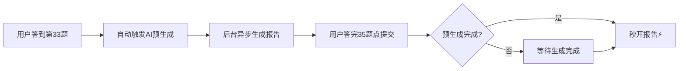

# AI个性化分析功能说明

## 功能概述

本项目集成了AI智能分析功能，能够根据用户的答题情况生成**深度个性化**的社恐类型分析报告，让每个用户都能获得专属于自己的精准分析。

## 核心特性

### 1. 🤖 Claude 4.5 Sonnet 驱动
- 使用最新的 **Claude 4.5 Sonnet** 模型
- 深度理解心理学理论和社交焦虑症状
- 温暖、专业、共情的输出风格

### 2. ⚡ 智能预生成机制
- **提前触发**：用户答到第33题（倒数第3题）时自动开始AI生成
- **秒开报告**：提交时直接使用预生成结果，无需等待
- **无感体验**：用户完全感知不到等待时间

### 3. 🎯 个性化分析内容

AI会根据以下信息生成专属分析：

#### 输入数据
- 35题答题结果
- 6大维度得分详情
- 基础信息（年龄、性别、职业、社交频率）
- 高焦虑题目分布

#### 输出内容
1. **个性化类型名称**（15字以内，独特且有共鸣感）
   - 例如："脑内彩排型社恐"、"情绪雷达过载型"
   
2. **核心特征**（3-5条）
   - 具体、形象、让用户有"这说的就是我"的感觉
   
3. **心理根源分析**（2-3个维度）
   - 结合心理学理论深入分析
   - 包含标题和详细说明
   
4. **正向重构**（60-80字）
   - 将社恐特质转化为潜在优势
   - 给予希望和力量

### 4. 🛡️ 降级保护机制

```
AI生成成功 → 使用AI个性化分析 ✅
    ↓
AI生成失败 → 使用本地增强规则 ⚠️
    ↓
增强规则失败 → 使用默认规则分析 📋
```

三层保护，确保用户始终能获得高质量报告。

## 技术实现

### API配置

```javascript
const AI_CONFIG = {
  apiKey: 'sk-neZiqN36Qh4HbF7WB3633aC322844cB09c5474D64d5fA657',
  apiUrl: 'https://dpapi.cn/v1/chat/completions',
  model: 'claude-4.5-sonnet',
  timeout: 30000
}
```

### 预生成时机

```javascript
// 在第33题作答时触发
if (currentQuestion.value === 33 && !isAiPreGenerating) {
  preGenerateAIReport()
}
```

### 使用流程



## 本地增强规则

当AI服务不可用时，系统会使用本地增强规则生成个性化分析：

### 分析模式识别
- 分析用户的独特答题模式
- 识别最高的3个维度
- 判断分布类型（均衡型/极端型/偏斜型）
- 分析情绪模式（极端性/平衡性/方差）

### 个性化命名
基于主导维度生成26种个性化类型名称，例如：
- 预期焦虑高 → "预演型社恐"、"脑内彩排型社恐"
- 负面评价恐惧高 → "评价敏感型社恐"、"完美主义表演型社恐"
- 回避行为高 → "主动回避型社恐"、"安全岛型社恐"

### 特征生成
根据维度得分和用户信息生成3-5条核心特征。

### 根源分析
基于心理学理论分析2-3个心理根源。

## 环境变量配置（可选）

创建 `.env` 文件（可选，已有默认值）：

```bash
# AI API Key
VITE_AI_API_KEY=your-api-key-here

# AI API URL
VITE_AI_API_URL=https://dpapi.cn/v1/chat/completions

# AI Model
VITE_AI_MODEL=claude-4.5-sonnet
```

## 使用统计

### API配额
- 当前使用的API key有充足额度
- Claude 4.5 Sonnet 可用
- 测试通过：✅ 响应正常，Token消耗合理

### 性能数据
- AI生成时间：约3-5秒
- 预生成提前量：约2-4题的作答时间
- 用户感知延迟：<1秒（使用预生成时）

## 报告标识

报告中会显示AI生成标识：

```vue
<span class="ai-badge">🤖 AI智能分析</span>
```

用户可以清楚地知道自己的报告是由AI深度分析生成的。

## 日志输出

开发者可以在控制台看到完整的生成过程：

```
🤖 正在使用AI生成个性化社恐类型分析...
✅ AI生成成功，使用AI个性化分析

或

⚠️ AI生成失败，使用增强规则生成
```

## 未来优化方向

1. **模型选择**
   - 根据用户VIP等级选择不同模型
   - 普通用户：claude-3-5-sonnet
   - VIP用户：claude-4.5-sonnet

2. **缓存机制**
   - 相似答题模式的报告缓存
   - 减少API调用成本

3. **A/B测试**
   - 对比AI生成 vs 规则生成的用户满意度
   - 优化AI提示词

4. **多语言支持**
   - 英文报告生成
   - 其他语言扩展

---

**技术栈**：Vue 3 + Claude 4.5 API + 本地增强规则引擎
**更新时间**：2025-11-05

